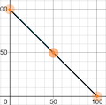
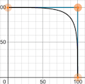
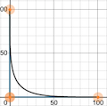
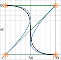

# circuit

badges

description

## installation

`go get -u github.com/schigh/circuit`

## usage

### Create new circuit breakers with `NewBreaker`

You can create new circuit breakers with `NewBreaker`.
`NewBreaker` takes a single `BreakerOptions` parameter:

```go
// BreakerOptions contains configuration options for a circuit breaker
type BreakerOptions struct {
    // Name is the circuit breaker name. If Name is not provided,
    // a unique Name will be created based on the caller to NewBreaker
    Name string

    // Timeout is the maximum duration that the Run func
    // can execute before timing out.  The default Timeout
    // is 3 seconds.
    Timeout time.Duration

    // BaudRate is the duration between error calculations.
    // The default BaudRate is 250ms.  The minimum BaudRate
    // is 10ms.
    BaudRate time.Duration

    // Backoff is the duration that a circuit breaker is
    // throttled.  The default Backoff is 1 minute.
    // The minimum Backoff is 1 second.
    BackOff time.Duration

    // Window is the length of time checked for error
    // calculation. The default Window is 5 minutes.
    // The minimum Window is 5 seconds.
    Window time.Duration

    // Threshold is the maximum number of errors that
    // can occur within the window before the circuit
    // breaker opens. By default, one error will open
    // the circuit breaker.
    Threshold uint32

    // LockOut is the length of time that a circuit breaker
    // is forced open before attempting to throttle.
    // If no lockout is provided, the circuit breaker will
    // transition to a throttled state only after its error
    // count is at or below the threshold.  While a circuit
    // breaker is open, all requests are rejected and no
    // new errors are recorded.
    LockOut time.Duration

    // OpeningWillResetErrors will cause the error count to reset
    // when the circuit breaker opens.  If this is set true, all
    // blocked calls will come from the throttled backoff, unless
    // the circuit breaker has a lockout duration.
    OpeningWillResetErrors bool

    // IgnoreContext will prevent context cancellation to
    // propagate to any in-flight Run functions.
    IgnoreContext bool

    // InterpolationFunc is the function used to determine
    // the chance of a request being throttled during the
    // backoff period.  By default, Linear interpolation is used.
    InterpolationFunc InterpolationFunc

    // PreProcessors are functions that execute in order before
    // the Runner function is executed.  If a preprocessor
    // returns an error, the execution is canceled and the error
    // is returned from Run.
    PreProcessors []PreProcessor

    // PostProcessors are functions that execute in order after
    // the Runner has executed.  The return values from the
    // Runner are passed along to the first postprocessor.
    // If there are subsequent postprocessors, each will take
    // the return value of its predecessor.
    PostProcessors []PostProcessor
}
```

```go
breaker := circuit.NewBreaker(circuit.BreakerOptions{
    Name:              "expensive_api_call",
    Timeout:           5 * time.Second,
    BackOff:           time.Minute,
    Window:            time.Minute,
    LockOut:           5 * time.Second,
    InterpolationFunc: circuit.Exponential,
})
```

> :warning: You **must** use `NewBreaker` to create circuit breakers.  
> Instantiating the `Breaker` struct directly will cause all calls to `Run(...)`
> to fail immediately

### Running the circuit breaker

You can run the circuit breaker by calling its `Run(...)` function.
`Run` takes two parameters: a `context.Context` instance, and a function matching
this signature:

```go
func(context.Context) (interface{}, error)
```

```go
breaker := circuit.NewBreaker(circuit.BreakerOptions{
    Name:              "expensive_api_call",
    Timeout:           5 * time.Second,
    BackOff:           time.Minute,
    Window:            time.Minute,
    LockOut:           5 * time.Second,
    InterpolationFunc: circuit.Exponential,
})

// ...

resultIface, err := breaker.Run(context.Background, func(ctx context.Context) (interface{}, error) {
    // DoSomethingExpensive returns *ResultType, error
    return dependency.DoSomethingExpensive()
})

if err != nil {
    // handle error
}
result, _ := resultIface.(*ResultType)
// do something with result
```

The `error` returned from `Run` can take the following forms:

| Error Kind                               | Description                                                     | Affects Error Count     |
|--------------------------------------    |-------------------------------------------------------------    |---------------------    |
| An error returned from your function     | An error from your implementation                               | Yes                     |
| `circuit.TimeoutError`                   | Returned when `Run` times out before completion                 | Yes                     |
| `circuit.StateOpenError`                 | Returned when the circuit breaker is open and/or locked out     | No                      |
| `circuit.StateThrottledError`            | Returned when the circuit breaker is throttled                  | No                      |

If the circuit breaker's `Timeout` setting is eclipsed while `Run` is executing,
the context will cancel and `Run` will return `nil, circuit.TimeoutError`.
The canceled context will propagate downstream to any logic that is listening for
context cancellation.  If the `IgnoreContext` flag of `BreakerOptions` is set true,
the context cancellation will _not_ propagate downstream.

#### Preprocessing and Postprocessing

You can intercept the parameters before invoking the Runner via preprocessors.
Likewise, you can intercept the Runner's output before returning from `Run` via
postprocessors.  Take the following example:

```go
type str string

breaker := circuit.NewBreaker(circuit.BreakerOptions{
    PreProcessors: []circuit.PreProcessor{
        func(ctx context.Context, runner circuit.Runner) (context.Context, circuit.Runner, error) {
            return context.WithValue(ctx, str("start"), time.Now().Unix()), runner, nil
        },
    },
    PostProcessors: []circuit.PostProcessor{
        func(ctx context.Context, i interface{}, err error) (interface{}, error) {
            end := time.Now().Unix()
            start, _ := ctx.Value(str("start")).(int64)
            fmt.Printf("Run took %d seconds", end-start)

            return i, err
        },
    }
})

```

The preprocessor intercepts the context and replaces it with a context with an added
value.  The Runner executes, and then the postprocessor intercepts the context and
extracts the value added in the preprocessor, which in this case is a time stamp.

The function signatures are as follows:

```go
type PreProcessor func(context.Context, Runner) (context.Context, Runner, error)
```

```go
type PostProcessor func(context.Context, interface{}, error) (interface{}, error)
```

Preprocessors run _before_ the circuit breaker's state or the context is checked
for fitness.  Preprocessors run in order, where the output `context.Context` and
`circuit.Runner` are input to each subscquent preprocessor.

> :information_source: If any preprocessor returns a non-nil error, that error is
> returned from `Run`.
>
> :warning: The `Run` function will _always_ return an error if a canceled or deadlined
> context is passed to the Runner.  If you want to override this behavior, you would
> use a preprocessor.

Postprocessors are executed in order after the Runner has returned a value, including
if the circuit breaker has timed out.  Like preprocessors, postprocessors pass their
output to the next postprocessor if there is one.  The final outputs are then returned
from `Run`.

### Transition States

The state transitions for circuit breakers are as follows:

| From          | To            | Description                                                                                                          |
|-----------    |-----------    |------------------------------------------------------------------------------------------------------------------    |
| New           | Closed        | The circuit breaker was just created                                                                                 |
| Closed        | Open          | The number of errors returned from `Run` exceeded the threshold for the measurement window                           |
| Open          | Throttled     | The circuit breaker's lockout has just expired (if set), and the number of errors is _at or below_ the threshold     |
| Throttled     | Open          | The number of errors returned from `Run` exceeded the threshold for the measurement window                           |
| Throttled     | Closed        | The backoff period has expired, and the number of errors is at or below the threshold                                |

### LockOut

When a circuit breaker opens, it will lock out for a specified duration.  During
that time, all invocations of `Run` immediately return a `circuit.StateOpenError`,
even if the error count has gone below the threshold.  By default, the lockout duration
is 0.  It can be set with the `LockOut` property of the `BreakerOptions` struct.

If there is no lockout set, the circuit breaker will transition from open to throttled
as soon as the error count is at or below the threshold.  If you want to throttle
immediately, set the `OpeningWillResetErrors` property of the `BreakerOptions` struct
to true.  If `OpeningWillResetErrors` is used, the error count drops to zero immediately
when the circuit breaker opens.

> :warning: Take care when using the `OpeningWillResetErrors` flag.  If used in conjunction
> with a short or no `LockOut`, the circuit breaker will cycle from open to throttled
> with high frequency

### Backoff Strategy

When the circuit breaker enters the throttled state, it uses an interpolation function
to determine how frequently it will allow subsequent calls to `Run` to be executed.
By default, the circuit breaker uses the `circuit.Linear` backoff strategy.

The backoff strategy works by dividing the backoff duration into 100 units.  For
each of those units `i in [1...100]`, the interpolation function returns a probability
score for `i` such that any call to `Run`will return a `circuit.StateThrottledError`.
If the interpolation function returns 100, **all** calls to `Run` return a throttling
error.  If the interpolation function returns 0, **no** calls to `Run` return a
throttling error.

#### Linear interpolation (default)



Linear interpolation returns a probability inversely proportional to `i`.
A circuit breaker will default to linear interpolation if an interpolation function
is not provided in `BreakerOptions`.

#### Logarithmic interpolation



Logarithmic interpolation initially returns a high probability, and quickly decreases
after half of the backoff duration has elapsed.

#### Exponential interpolation



Exponential interpolation will initially decrease probability rapidly and eases
up after half of the backoff duration has elapsed.

#### Ease-In-Out interpolation



Ease-In-Out interpolation will initially return a higher probability and quickly
decrease as the backoff duration approaches its midpoint.  The rate of decrease
will slow down shortly after the backoff midpoint has elapsed.

> :warning: If a throttled circuit breaker reopens, the current backoff period is
> discarded and will start over if the circuit breaker becomes throttled again.

### Capturing circuit breaker state changes

All circuit breaker state changes are exposed via a read-only channel.  You can
access this channel by calling `StateChange()` on the circuit breaker:

```go
breaker := circuit.NewBreaker(circuit.BreakerOptions{})
changeChan := breaker.StateChange()

go func(breaker *circuit.Breaker, changeChan chan circuit.BreakerState) {
    for {
        select {
        case state := <-changeChan:
            doSomethingWith(state)
        }
    }
}(breaker, changeChan)

```

#### `BreakerState`

The circuit breaker uses the `BreakerState` struct to communicate state changes:

```go
type BreakerState struct {
    Name        string     `json:"string"`
    State       State      `json:"state"`
    ClosedSince *time.Time `json:"closed_since,omitempty"`
    Opened      *time.Time `json:"opened,omitempty"`
    LockoutEnds *time.Time `json:"lockout_ends,omitempty"`
    Throttled   *time.Time `json:"throttled,omitempty"`
    BackOffEnds *time.Time `json:"backoff_ends,omitempty"`
}
```

The properties of `BreakerState` will vary depending on the current state of the
circuit breaker:

- `Name` and `State` are always set
- `ClosedSince` is nil unless the state is `Closed`.  This value indicates when
the circuit breaker was closed.
- `Opened` is nil unless the state is `Open`.  This value indicates when the circuit
breaker was opened.
- `LockoutEnds` is nil unless the state is `Open` **and** the circuit breaker has
a lockout duration set.  This value indicates when the current lockout period will
end.
- `Throttled` is nil unless the state is `Throttled`.  This value indicates when
the circuit breaker entered the throttled state.
- `BackOffEnds` is nil unless the state is `Throttled`.  This value indicates when
the circuit breaker entered the throttled state.

> :information_source: The `State` property of `BreakerState` is an integer.  However,
> when the circuit breaker state is serialized, its string value is returned

### Reading circuit breaker state

There are a few ways you can examine a circuit breaker to see how it's getting along:

#### `State()`

If you only want the circuit breaker's current state, this is the function you want
to use, as it's the least disruptive to the internal workings of the circuit breaker.
`State()` returns a `circuit.State` value:

```go
breaker := circuit.NewBreaker(circuit.BreakerOptions{})
state := breaker.State()
// do something with state
```

#### `Size()`

`Size()` returns the number of errors counted in the current window.  The primary
usefullness of this function is to observe the decay rate for circuit breaker tuning:

```go
breaker := circuit.NewBreaker(circuit.BreakerOptions{})

...

t := time.NewTicker(100 * time.Millisecond)
go func(breaker *circuit.Breaker, t *time.Ticker){
    for {
        select {
        case <-t.C:
            _,_ = fmt.Fprintf(os.StdErr, "size: %d\n", breaker.Size())
        }
    }
}(breaker, t)
```

#### `Snapshot()`

`Snapshot()` will give you the same information that is made available during a
state change event (a `BreakerState` struct).

## `Box`

Managing an individual circuit breaker is fairly simple, but it can quickly become overwhelming when you need to manage several circuit breakers at once.

The Breaker `Box` allows you to quickly and easily manage multiple circuit breakers within your application.
