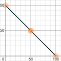
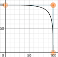
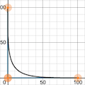
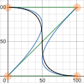

<p align="center">
  
</p>

<p align="center">
  A highly-tunable circuit breaker for Go.
</p>

Circuit implements the [circuit breaker](https://www.martinfowler.com/bliki/CircuitBreaker.html) design pattern with gradual recovery via probabilistic throttling, type-safe generics, and zero background goroutines.

## Installation

```
go get github.com/schigh/circuit
```

Requires Go 1.22+.

## Quick Start

```go
b, err := circuit.NewBreaker(
    circuit.WithName("my-api"),
    circuit.WithThreshold(5),
    circuit.WithWindow(time.Minute),
    circuit.WithBackOff(30 * time.Second),
)
if err != nil {
    log.Fatal(err)
}

result, err := circuit.Run(b, ctx, func(ctx context.Context) (*Response, error) {
    return client.Call(ctx, request)
})
```

`Run` is generic — the return type is inferred from your function. No type assertions needed.

## Table of Contents

- [Creating Circuit Breakers](#creating-circuit-breakers)
- [Running with Type Safety](#running-with-type-safety)
- [Two-Step Mode (Allow/Done)](#two-step-mode-allowdone)
- [Error Classification](#error-classification)
- [State Transitions](#state-transitions)
- [Lockout](#lockout)
- [Backoff Strategies](#backoff-strategies)
- [Observability](#observability)
  - [State Change Notifications](#state-change-notifications)
  - [Metrics Collection](#metrics-collection)
  - [Snapshots](#snapshots)
- [Managing Multiple Breakers](#managing-multiple-breakers)
- [Panic Handling](#panic-handling)
- [Configuration Reference](#configuration-reference)

## Creating Circuit Breakers

All breakers must be created with `NewBreaker`. It accepts functional options:

```go
b, err := circuit.NewBreaker(
    circuit.WithName("payment-gateway"),
    circuit.WithTimeout(5 * time.Second),
    circuit.WithThreshold(10),
    circuit.WithWindow(2 * time.Minute),
    circuit.WithBackOff(30 * time.Second),
    circuit.WithLockOut(5 * time.Second),
    circuit.WithEstimationFunc(circuit.Exponential),
)
```

If no name is provided, one is generated from the caller's file and line number. See [Configuration Reference](#configuration-reference) for all options and defaults.

## Running with Type Safety

The `Run` function wraps your call with circuit breaker protection and returns a typed result:

```go
user, err := circuit.Run(b, ctx, func(ctx context.Context) (*User, error) {
    return userService.GetByID(ctx, userID)
})
if err != nil {
    switch {
    case errors.Is(err, circuit.ErrStateOpen):
        // circuit is open — dependency is down
        return cachedUser, nil
    case errors.Is(err, circuit.ErrStateThrottled):
        // circuit is recovering — request was shed
        return nil, status.Error(codes.Unavailable, "service recovering")
    case errors.Is(err, circuit.ErrTimeout):
        // function exceeded the configured timeout
        return nil, status.Error(codes.DeadlineExceeded, "upstream timeout")
    default:
        // error from your function
        return nil, err
    }
}
```

The function is called **synchronously** — the caller controls concurrency. If a timeout is configured, it is applied via `context.WithTimeout`. The runner must respect `ctx.Done()` for timeouts to take effect.

### Error Types

| Error | Description | Affects Error Count |
|-------|-------------|---------------------|
| Your function's error | Returned as-is | Yes |
| `circuit.ErrTimeout` | Context deadline exceeded | Yes |
| `circuit.ErrStateOpen` | Circuit is open, request rejected | No |
| `circuit.ErrStateThrottled` | Request shed during throttled recovery | No |
| `circuit.ErrNotInitialized` | Breaker not created with `NewBreaker` | No |

All circuit errors carry context — use `errors.As` to extract the breaker name and state:

```go
var circErr circuit.Error
if errors.As(err, &circErr) {
    log.Printf("breaker=%s state=%s: %s", circErr.BreakerName, circErr.State, circErr.Error())
}
```

## Two-Step Mode (Allow/Done)

For HTTP middleware, gRPC interceptors, or any pattern where you don't wrap the call directly, use the two-step `Allow`/`done` pattern:

```go
func CircuitBreakerMiddleware(b *circuit.Breaker) func(http.Handler) http.Handler {
    return func(next http.Handler) http.Handler {
        return http.HandlerFunc(func(w http.ResponseWriter, r *http.Request) {
            done, err := b.Allow(r.Context())
            if err != nil {
                http.Error(w, "service unavailable", http.StatusServiceUnavailable)
                return
            }

            rec := &statusRecorder{ResponseWriter: w, status: 200}
            next.ServeHTTP(rec, r)

            // Report the outcome to the breaker
            if rec.status >= 500 {
                done(fmt.Errorf("HTTP %d", rec.status))
            } else {
                done(nil)
            }
        })
    }
}
```

`Allow` checks the breaker state and returns a `done` callback. Call `done(err)` after the operation completes to report the outcome. No timeout is applied — the caller controls timing.

## Error Classification

By default, any non-nil error counts as a failure. You can customize this with two callbacks:

### Excluding Errors

Excluded errors are not counted at all — neither as successes nor failures. Use this for errors that don't indicate dependency health:

```go
b, _ := circuit.NewBreaker(
    circuit.WithName("user-api"),
    circuit.WithIsExcluded(func(err error) bool {
        // Don't count client cancellations against the dependency
        return errors.Is(err, context.Canceled)
    }),
)
```

### Classifying Errors as Successes

Some errors indicate the dependency is healthy but the request was rejected for business reasons:

```go
b, _ := circuit.NewBreaker(
    circuit.WithName("inventory-api"),
    circuit.WithIsSuccessful(func(err error) bool {
        // 404 means the service is healthy, just no data
        var httpErr *HTTPError
        if errors.As(err, &httpErr) {
            return httpErr.StatusCode == 404 || httpErr.StatusCode == 409
        }
        return false
    }),
)
```

The evaluation order is: `IsExcluded` → `IsSuccessful` → failure.

## State Transitions

Circuit breakers have three states:

```
         errors > threshold
  Closed ──────────────────────► Open
    ▲                              │
    │                              │ lockout expires AND
    │                              │ errors ≤ threshold
    │                              ▼
    └──────────────────────── Throttled
       backoff expires AND
       errors ≤ threshold
```

| From | To | Condition |
|------|-----|-----------|
| Closed | Open | Error count in window exceeds threshold |
| Open | Throttled | Lockout expired (if set) and errors ≤ threshold |
| Throttled | Open | Error count exceeds threshold during recovery |
| Throttled | Closed | Backoff period expired and errors ≤ threshold |

State evaluation is **lazy** — transitions happen when `Run`, `Allow`, `State`, or `Snapshot` is called. There are no background goroutines. A breaker with no traffic stays in its current state.

## Lockout

When a circuit breaker opens, it can lock out for a specified duration. During lockout, all requests are rejected with `ErrStateOpen`, even if the error count drops below the threshold.

```go
b, _ := circuit.NewBreaker(
    circuit.WithName("fragile-service"),
    circuit.WithThreshold(3),
    circuit.WithLockOut(10 * time.Second),  // forced open for 10s after tripping
)
```

If no lockout is set, the breaker transitions to throttled as soon as errors drop below the threshold. Combine with `WithOpeningResetsErrors(true)` for immediate throttling:

```go
b, _ := circuit.NewBreaker(
    circuit.WithName("fast-recovery"),
    circuit.WithThreshold(5),
    circuit.WithOpeningResetsErrors(true),  // clear errors on open → immediate throttle
    circuit.WithBackOff(15 * time.Second),
)
```

## Backoff Strategies

During the throttled state, the breaker probabilistically sheds requests using an estimation function. The backoff duration is divided into 100 ticks. At each tick, the function returns a probability (0–100) that a request should be blocked.

### Built-in Strategies

```go
b, _ := circuit.NewBreaker(
    circuit.WithName("api-gateway"),
    circuit.WithBackOff(30 * time.Second),
    circuit.WithEstimationFunc(circuit.Exponential),
)
```

#### Linear (default)

Steady, proportional decrease in blocking probability.



#### Logarithmic

High blocking initially, rapid decrease after the midpoint.



#### Exponential

Rapid initial decrease, gradual easing toward full throughput.



#### Ease-In-Out

Smooth S-curve — high blocking early, steep drop at midpoint, gentle finish.



#### JitteredLinear

Linear with ±5 random jitter to prevent thundering herd effects during recovery.

### Custom Strategies

Implement your own `EstimationFunc`:

```go
// HalfOpen mimics a traditional half-open pattern:
// block everything for the first half, then allow everything
func HalfOpen(tick int) uint32 {
    if tick <= 50 {
        return 100 // block all
    }
    return 0 // allow all
}

b, _ := circuit.NewBreaker(
    circuit.WithEstimationFunc(HalfOpen),
)
```

## Observability

### State Change Notifications

Every breaker exposes a buffered channel for state change events:

```go
b, _ := circuit.NewBreaker(circuit.WithName("my-service"))

go func() {
    for state := range b.StateChange() {
        log.Printf("breaker %s: %s", state.Name, state.State)
        if state.Opened != nil {
            log.Printf("  opened at: %s", state.Opened)
        }
        if state.LockoutEnds != nil {
            log.Printf("  lockout ends: %s", state.LockoutEnds)
        }
        if state.BackOffEnds != nil {
            log.Printf("  backoff ends: %s", state.BackOffEnds)
        }
    }
}()
```

Or use a callback for inline handling:

```go
b, _ := circuit.NewBreaker(
    circuit.WithName("my-service"),
    circuit.WithOnStateChange(func(name string, from, to circuit.State) {
        log.Printf("breaker %s: %s → %s", name, from, to)
        alerting.Notify(name, to)
    }),
)
```

The callback runs after the state mutex is released, so it does not block other requests.

### Metrics Collection

Implement the `MetricsCollector` interface for integration with Prometheus, StatsD, OpenTelemetry, etc.:

```go
type prometheusCollector struct {
    successes  *prometheus.CounterVec
    errors     *prometheus.CounterVec
    timeouts   *prometheus.CounterVec
    rejected   *prometheus.CounterVec
    excluded   *prometheus.CounterVec
    duration   *prometheus.HistogramVec
    transitions *prometheus.CounterVec
}

func (p *prometheusCollector) RecordSuccess(name string, d time.Duration) {
    p.successes.WithLabelValues(name).Inc()
    p.duration.WithLabelValues(name, "success").Observe(d.Seconds())
}

func (p *prometheusCollector) RecordError(name string, d time.Duration, err error) {
    p.errors.WithLabelValues(name, errorType(err)).Inc()
    p.duration.WithLabelValues(name, "error").Observe(d.Seconds())
}

func (p *prometheusCollector) RecordTimeout(name string) {
    p.timeouts.WithLabelValues(name).Inc()
}

func (p *prometheusCollector) RecordStateChange(name string, from, to circuit.State) {
    p.transitions.WithLabelValues(name, from.String(), to.String()).Inc()
}

func (p *prometheusCollector) RecordRejected(name string, state circuit.State) {
    p.rejected.WithLabelValues(name, state.String()).Inc()
}

func (p *prometheusCollector) RecordExcluded(name string, err error) {
    p.excluded.WithLabelValues(name, errorType(err)).Inc()
}
```

```go
b, _ := circuit.NewBreaker(
    circuit.WithName("payment-api"),
    circuit.WithMetrics(&prometheusCollector{...}),
)
```

The `RecordError` method includes the error itself, enabling classification by error type in dashboards.

### Snapshots

Get a point-in-time snapshot of the breaker's state with timing information:

```go
snap := b.Snapshot()
fmt.Printf("State: %s\n", snap.State)

// Expose as a health check endpoint
func healthHandler(b *circuit.Breaker) http.HandlerFunc {
    return func(w http.ResponseWriter, r *http.Request) {
        snap := b.Snapshot()
        w.Header().Set("Content-Type", "application/json")
        if snap.State == circuit.Open {
            w.WriteHeader(http.StatusServiceUnavailable)
        }
        json.NewEncoder(w).Encode(snap)
    }
}
```

Other accessors:

```go
b.Name()   // returns the breaker's name
b.State()  // returns the current state (triggers lazy evaluation)
b.Size()   // returns the number of errors in the current window
```

## Managing Multiple Breakers

Use `BreakerBox` to manage breakers for multiple dependencies:

```go
box := circuit.NewBreakerBox()

// Create breakers for each dependency
userBreaker, _ := box.Create(
    circuit.WithName("user-service"),
    circuit.WithThreshold(5),
)
orderBreaker, _ := box.Create(
    circuit.WithName("order-service"),
    circuit.WithThreshold(10),
)

// All state changes are forwarded to the box channel with full timing info
go func() {
    for state := range box.StateChange() {
        log.Printf("[%s] %s", state.Name, state.State)
    }
}()

// Load a breaker by name
if b := box.Load("user-service"); b != nil {
    result, err := circuit.Run(b, ctx, func(ctx context.Context) (*User, error) {
        return userClient.Get(ctx, id)
    })
}
```

### LoadOrCreate

For lazy initialization in request handlers — safe for concurrent use:

```go
func (s *Server) GetUser(ctx context.Context, id string) (*User, error) {
    b, err := s.box.LoadOrCreate("user-service",
        circuit.WithThreshold(5),
        circuit.WithBackOff(30 * time.Second),
    )
    if err != nil {
        return nil, err
    }

    return circuit.Run(b, ctx, func(ctx context.Context) (*User, error) {
        return s.userClient.Get(ctx, id)
    })
}
```

`LoadOrCreate` is safe for concurrent callers — only one breaker is created per name.

### AddBYO

Add externally-created breakers to the box for storage/retrieval. State changes from BYO breakers are **not** forwarded to the box channel:

```go
b, _ := circuit.NewBreaker(circuit.WithName("custom"))
err := box.AddBYO(b)
```

## Panic Handling

If the function passed to `Run` panics, the panic is:
1. Recorded as a failure (incrementing the error count)
2. Re-raised so the caller's recovery logic can handle it

```go
defer func() {
    if r := recover(); r != nil {
        log.Printf("caught panic: %v", r)
    }
}()

circuit.Run(b, ctx, func(ctx context.Context) (string, error) {
    panic("something went wrong")
})
```

## Configuration Reference

| Option | Default | Minimum | Description |
|--------|---------|---------|-------------|
| `WithName(s)` | auto-generated | — | Breaker identifier |
| `WithTimeout(d)` | 10s | — | Context timeout applied to `Run` |
| `WithThreshold(n)` | 0 (opens on first error) | — | Max errors in window before opening |
| `WithWindow(d)` | 5m | 10ms | Sliding window for error counting |
| `WithBackOff(d)` | 1m | 10ms | Duration of throttled recovery |
| `WithLockOut(d)` | 0 (no lockout) | — | Forced-open duration before throttling |
| `WithEstimationFunc(f)` | `Linear` | — | Throttle probability curve |
| `WithOpeningResetsErrors(v)` | `false` | — | Clear error count when opening |
| `WithIsSuccessful(fn)` | `nil` | — | Classify errors as successes |
| `WithIsExcluded(fn)` | `nil` | — | Exclude errors from tracking |
| `WithMetrics(m)` | `nil` | — | Metrics collector implementation |
| `WithOnStateChange(fn)` | `nil` | — | State transition callback |

## License

MIT — see [LICENSE](LICENSE).
